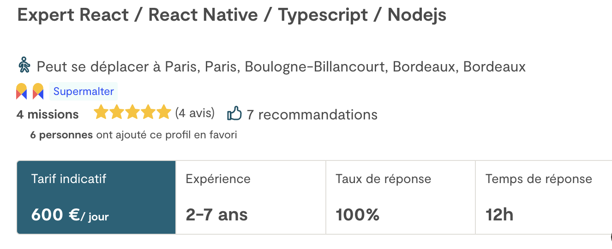

# Comment percer sur Malt

Tu es développeur, et tu as envie de ~~faire de l’argent~~ travailler sans prise de tête dans une entreprise. Tu décides donc de te créer un compte Malt, tu mets tes expériences, tes technos de coeur, une bio, des images, etc…

Sauf que là, des souvenirs similaires à ton expérience sur Tinder remontent. Tu n’as aucun match. Aucune proposition. Rien.
😥

  

Donc t’es là en train de lire ce post à la con pour essayer de trouver des éléments de réponse et peut-être te convaincre qu’il y a encore espoir.Et bien devines quoi, **OUI, il y a espoir !**

Pour toi, je vais te donner quelques clés pour t’aider à t’élever dans la Maltosphère.

On va partir d’un constat simple, Malt est un moteur de recherche.
À partir de là, on a plusieurs choses à optimiser pour que ton profil soit remonté dans l’algorithme. Ensuite on fera un trick pour monter considérablement ton sex-appeal sur la plateforme, ce qui t’assurera des propositions de missions.
 

> :warning: **Ne saute pas la partie 1 !**  Elle est très importante, et sans elle la partie 2 ne servira à rien.

 

### 1) SEO sur Malt

#### 1- Profil complété à 100%.

On commence par la base.

- [ ] Documents légaux à jour
- [ ] Titre du profil
- [ ] Description du profil
- [ ] Images portfolio
- [ ] Expériences professionnelles (essaie d’en avoir au moins 3. Bullshit si tu ne les as pas. Personne ne regarde réellement.)

#### 2 - Recommandations

Elles comptent énormément, alors n’hésites pas à demander à des amis freelances sur la plateforme, ou des anciennes personnes en entreprises de te recommander.

#### 3 - Disponibilité confirmée

Tu dois régulièrement confirmer ta disponibilité sur la plateforme. Essaie de tous les jours / 2 jours de te connecter pour confirmer celle-ci.

#### 4 - Expérience

Jamais en dessous de 2 ans. Même si vous n'avez pas d'exp, allez-y au talent et dites que vous êtes un expert. Vous n'imaginez pas le nombre de boîtes qui ne savent pas différencier un dev junior d'un dev senior.

#### 5 - Mots clés

Tu recherches une mission en React ? Cool ! Pourquoi tu ne l'indique nulle part ?
Clairement tu dois mettre dans ton profil, ta bio et tes skills, les mots clés que les entreprises sont susceptibles de chercher.

Par priorité:

1 - Ton titre 2 - Ta bio 3 - Tes skills 4 - Tes expériences passées.

Certains mots clés prévalent plus que d’autres, mais ce que tu dois retenir c’est que les technos sont numéro 1 (React, Typescript, Python, etc…).

### 

Ici vous voyez dans mon titre mes principales technos, mais vous les retrouverez aussi dans ma bio, mes expériences, ma liste de compétences, etc...

#### 6 - Taux de réponse

Tu dois répondre le plus vite possible à tes propositions de missions, même si elles ne te plaisent pas.
Ce critère est très important et a beaucoup de poids.

#### 7 - Copie les top profils

Mets toi en navigation privée, et tapes les mots clés sur lesquels tu te positionne. (Javascript par exemple).
Ensuite prend les 10 premiers profils, et regarde leur points communs (mots clés utilisés dans leur bio, nombre d’exp, titre, etc..).
Inspire-toi ensuite de ça pour construire ton profil.

Les grands artistes copient, les génies volent.

### 2) Le cheat code

Sur Malt, il existe deux types de personnes. Ceux qui ont fait leur première mission, et les autres.

Si tu fais partie de ceux qui n’ont pas débloqué leur première mission, bon courage.

L’idée ici est de tricher en demandant à un ami de t’acheter une mission sur Malt, tout en le remboursant immédiatement après.
Tu perds 15% de la somme en remboursant ton ami (les frais de commissions), mais avec ça, tu fais désormais partie de l’élite de Malt, ceux qui ont effectué une mission sur la plateforme.

Mets 500 à 1000 euros pour ta première mission, ça suffira. Si jamais tu veux mettre plus, coupe le montant en plusieurs missions.

**Et d’un coup c’est magique !** Tu reçois des offres, les gens te répondent, ton profil Tinder fonctionne !

### 3) Conclusion

Évidemment, je ne parle pas de tous les aspects dans ce tutoriel. Seulement comment recevoir des offres.

Ce qui va faire également une énorme différence est votre relation client, savoir vous présenter à l’oral, bien vous vendre en termes de travail d’équipe et de compétences, etc..

Freelance c’est aussi un métier commercial, ou l’on vend sa personne pour une contrepartie financière (Non, ne pense à rien d’autre).

Si jamais ces autres sujets vous intéressent, n’hésitez pas à ne pas me le dire car j’ai la flemme d’écrire un nouvel article.

En tout cas j’espère que ce contenu vous sera utile.

Peace ! ✌️
